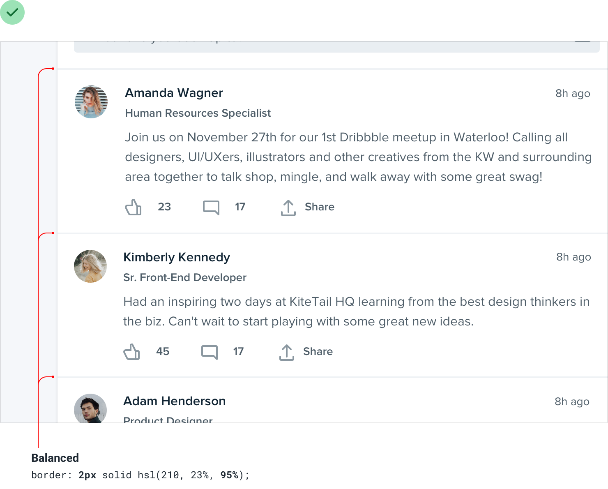

# 2. Hierarchy is everything
## 1. Not all elements are equal

## 2. Size isn't everything

## 3. Don't use grey text on colored backgrounds

## 4. Emphasize by de-emphasizing
### Exemplo 1

### Exemplo 2

## 5. Labels are a last resort
### Exemplo 1

### Exemplo 2

### Exemplo 3

### Exemplo 4

## 6. Separate visual hierarchy from document hierarchy

## 7. Balance weight and contrast
### Exemplo 1

### Exemplo 2

## 8. Semantics are secondary

